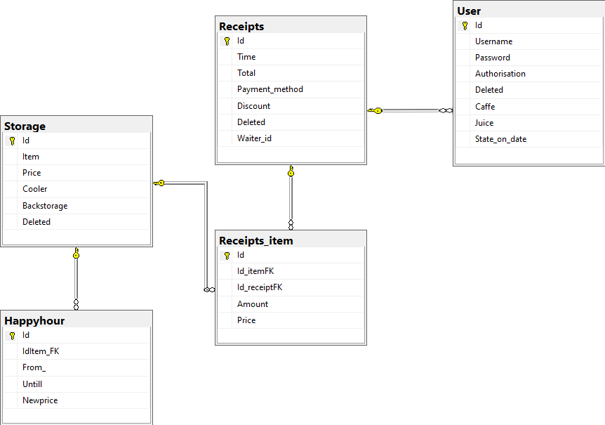

# RP3_Projekt
[![CC BY-NC-SA 4.0][cc-shield]][cc]

Window Forms application for Coffee Shop in [VS 2019](https://visualstudio.microsoft.com/vs/).

Presentation is avalible in [Documentation/_RP3__Projekt_NOVO.pdf](Documentation/_RP3__Projekt_NOVO.pdf).

## Zadatak
*Caffe Bar - Blagajna za caffe bar.*

 >Napravite aplikaciju za caffe bar koja omogućava ispis računa te prati stanje artikala u skladištu i u hladnjaku caffe bara. Trebaju postojati dva različita načina logiranja u aplikaciju: za konobare i za vlasnika, odnosno voditelja. Na početku smjene glavni konobar se ulogirava u aplikaciju te izdaje račune u svoje ime. Na kraju smjene konobar mora zatražiti ispis prometa i zarade te se nakon toga odlogirava. Aplikacija izlistava svu trenutnu ponudu pića u caffe baru te konobar odabire piće i količinu koja je naručena te ispisuje račun. Nakon toga mora upisati s koliko novaca je gost platio te mu aplikacija računa koliko mu treba vratiti. Također, konobar ima uvid u stanje skladišta i hladnjaka. Konobar hladnjak puni artiklima iz skladišta. Aplikacija stalno prati stanje u skladištu i u hladnjaku te konobara upozorava na male količine određenih artikala, odnosno treba li naručiti neke artikle jer ih je malo u skladištu ili treba napuniti hladnjak. Konobar mora obavijestiti aplikaciju o dolasku naručenih artikla te unijeti količinu novih artikala. Konobari imaju pravo na dvije kave u smjeni i jedan cijeđeni sok besplatno, ali svejedno moraju ispisati račun za to kako bi se moglo pratiti stanje u skladištu. Na svako piće izvan toga, imaju popust u iznosu od 20% cijene pića. Kada se vlasnik ulogira u aplikaciju postoji mogućnost unosa novih pića u sustav te brisanje ili mijenjanje cijene već postojećih. Vlasnik također mora moći unositi i brisati konobare koji su trenutno zaposleni, tj. napraviti njihove korisničke račune.  Također, aplikacija nudi mogućnost računanja količine konzumacije određenog artikla u određenom vremenu kako bi se što bolje moglo odrediti što gosti najviše/najmanje naručuju. Postoji i mogućnost stavljanja nekih artikala na akciju u određeno vrijeme, odnosno happy hour.

Zadatak je predložio tim: {GM, KM, ČM, VF} ⇒ +5 bodova

## Requirements:
To run the application it needs to be connected to database with record structure. To modify, install:
- [MS sql server - Express edition](https://www.microsoft.com/en-us/sql-server/sql-server-downloads)
- [Microsoft RDLC Report Designer](https://marketplace.visualstudio.com/items?itemName=ProBITools.MicrosoftRdlcReportDesignerforVisualStudio-18001) to install, in Visual Studio go to: _Extensions_-> _Manage Extensions_, under _Online_ search for **Microsoft RDLC Report Designer** and install it.
- [SQL Server Management Studio](https://docs.microsoft.com/en-us/sql/ssms/download-sql-server-management-studio-ssms?view=sql-server-ver15) _required only for direct database editing_

## Model design
Application consists of one main form that is used like a controller for opening wanted subforms.
- `class DB` Used for getting connection to the database.
- `class Service` used for [CRUD](https://en.wikipedia.org/wiki/Create,_read,_update_and_delete) operations to database
- `class User` used for simulating SESSION variable in application

These classes are defined in respective files: `<class name>.cs`.

### Description of `class DB`
```cs
 internal static class DB
    {
        internal static string connection_string ;

        internal static SqlConnection getConnection();      
        internal static void closeConnection();
    }
 ```

 ### Description of `class User`
```cs
internal static class User
    {
        public static string name;
        public static string authorisation;
        public static int id;
        public static bool showNotification;
    }
 ```
  ### Description of `class Service`
```cs
internal class Service
    {
        //  Get items on Caffe's menu
        internal static List<Tuple<int, String>> getMenuItems(out String errorMessage);
        //  Get item details for new receipt from STORAGE --- (coolerAmount,price)
        internal static Tuple<int, decimal> getPriceCooler(in int id, out String errorMessage);
        //  Insert new receipt
        internal static String newReceipt(DataTable dataTableReceipt, String PaymentMethod, out Double total, out Int32 receiptId, double discount);
        //  Get receipt atributes
        internal static List<String> getReceiptDetails(int receiptID, out String errorMessage);
        //  Get list of all empoyes
        public static List<Tuple<String, String>> getAllEmployeData(out String errorMessage);
        //  Check if item is on HappyHour 
        internal static bool onHappyHour(in int itemId, out decimal newPrice, out String errorMessage);
        internal static void removeExpiredFromHappyHour(in int itemId, out String errorMessage);
        internal static String addToHappyHour(int itemId, in DateTime from_, in DateTime untill, decimal price);
        // add amount to cooler
        internal static void addAmount(int id, int addAmount, string column, out String errorMessage);
        //  Get discount for employee
        internal static Tuple<int, int> getDiscount(string employes, out string errorMessage)
        //  Use discount for employee
        internal static void useDiscount(string employes, out string errorMessage, string item, int times);
        internal static DataSet getItemCount();
        //  Get items on past receipt
        internal static DataSet getReceiptItems(in int id);
        //  Delete past receipt
        internal static void deleteReceipt(in string id, out string errorMsg);
    }
 ```


## Usage description
There are 2 types of users of this application depending on their authorisation. First ones are waters which can not do things like delete past receipts, etc. The other ones are admins who can do everything implemented in the application.

When issuing new receipt the application requires users to input customer name so it can apply the appropriate discount. By default, application uses `Regular customer` if it's an employee and they want to use their discount, they have to change the customer select to their username. After that appropriate discount is applied.

When adding an item to new receipt, user has to click on the button with the item's name. Also, if user wants to delete item from new receipt he needs to select *whole* row and click button `delete item` otherwise the error message will appear.
To print receipt press `Print receipt` button, after which receipt will be displayed for printing. Also, if cash was chosen as the payment method, `Change` form will be displayed to calculate change.
To close register appropriate button needs to be clicked on, the application will generate daily reports for printing and/or saving and user will be logged out.

To view previous receipts, user goes to submenu `Receipts`, there he can input time filter for receipts. To view details of the receipt receipt row has to be selected and double clicked. Also to delete receipt, appropriate row has to be selected and `Delete` button has to be pressed, this action is reserved for admins.

To view the consumption of drinks in a certain period submenu `Consumption` has to be selected from `Register` menu. There time filter can be set by user, results will be displayed on the graph and in table for more details.

Management menu contains forms for `Storage` and `Happy hour` subforms. A storage form contains a list of items in back storage and in cooler which can be filtered by name via filter input. To move an item from the back storage to cooler, double click on cooler column of wanting item and enter new wanted amount in cooler. The application will auomaticly remove required amount of backing storage if the remaining amount in back storage is insufficient appropriate message will be displayed. To edit or delete items from storage select wanted item row and click on the appropriate button.
>Add, edit and delete item actions are restricted to admins.

`Show notification` is used to enable warnings low cooler stock of any item. Same notifications can be disabled when they are displayed by clicking the button ` Disable notification`.

`Happy hour` subform is used to add items to happy hour, users with appropriate authorisation needs to select wanted item's row, input happy hour duration, new price and click `Add item`.

Menu item `Accounts` is used for to add and remove users from the application. Also item `Help` contains a list of instructions for application.


## Database schema



# License

 [RP3_Projekt](https://github.com/nesto123/RP3_Projekt) © 2021 by [Fran Vojković](https://github.com/nesto123) is licensed under [Attribution-NonCommercial-ShareAlike 4.0 International][cc].

[![CC 4.0][cc-image]][cc]


[cc]: LICENSE
[cc-image]: https://licensebuttons.net/l/by-nc-sa/4.0/88x31.png
[cc-shield]: https://img.shields.io/badge/License-CC%20BY--SA%204.0-lightgrey.svg


<!--© 2021 Fran Vojković, Martina Gaćina, Matea Čotić, Mirna Keser, All rights reserved.

Licensed under [License](LICENSE).-->


